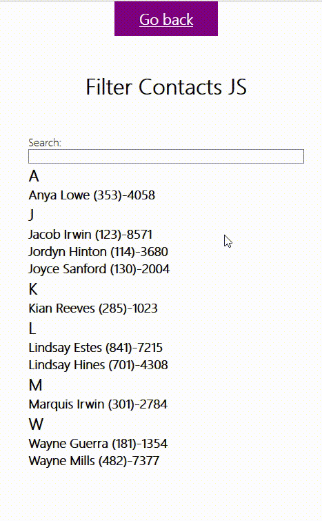
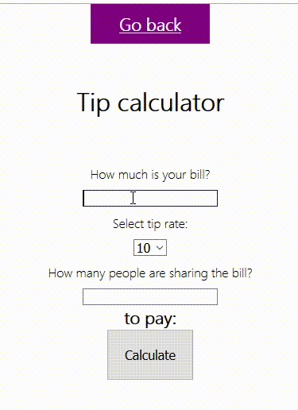
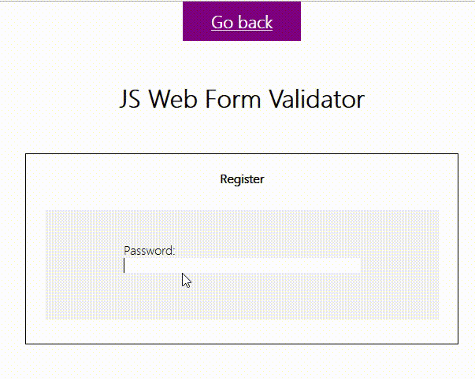

# JS Mini Projects

## About

  This repo contains quick mini javascript projects in practicing DOM and vanilla JS. To showcase and as well as keeping my JavaScript skills fresh.   Bundled using parcel (due to easy config)

<h4>
  Instructions:
</h4>
Note: The main page will display a list of projects with basic css, simply click the link for the project you wish to check out. 

1. `clone or fork`
2. `npm install`
3. `npm start`

## Current Projects to date

#### Weather search /w OpenWeatherAPI

Uses the OpenWeatherAPI to retrieve weather location data. This mini project provides displaying the search results as well as displaying the current location selected when making a query. I have used the REST countries API to display the corresponding country flag by passing the retrieved ISO code from the weather api 

#### Contacts filter

The contacts that are provided are randomly generated from a function containg a list of names. Searching for a name will display only that contact/section e.g. J => John Doe (555)-5555

#### Tip calculator

Will display how much is owed in tips. Calculates the moment you select/add values into each field.

#### Password strength indicator

Displays strength indication based off the input the field receives as well as using regEx to increase the indicator strength if special characters are included.

